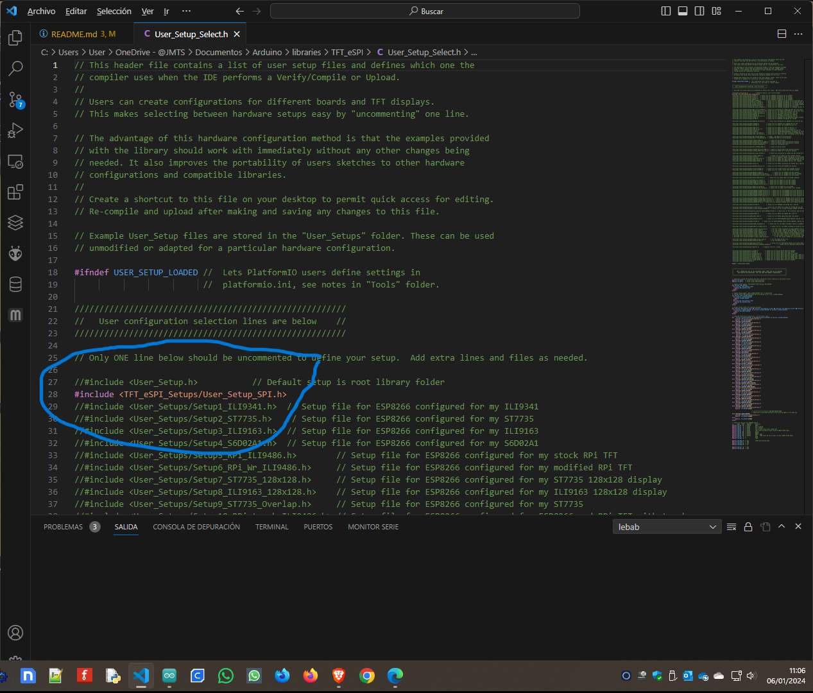

<h1>CALENDARIO CON TEMPERATURA, HUMEDAD Y SENSACIÓN TÉRMICA CON ESP32 Y ENVIO A BASE DE DATOS EN UNA TFT 480 x 320</h1>

Es una variación del otro reloj que tengo publicado la diferencia está en la TFT

Se visualiza la Fecha, la Hora, el día de la semana, el día, el mes y el año.
Se actualiza solo el horario de verano.
Tambien se visualiza la temperatura, la humedad y la sensación termica.

La estructura de la base de datos y la publicación en la web la puedes ver en el otro Reloj."# Calendario_Temperatura_Humedad_TFT" 

Nota: "En la placa WEMOS D1 R32 no se muestran datos porque no hay conectado un sensor DHT"
Probado con ESP32 DEVKIT y WEMOS D1 R32 (En la placa WEMOS D1 R32 con forma de arduino 1 para que funcione hay que realizar las modificaciones descritas en la libreria TFT_eSPI y en https://github.com/s60sc/Adafruit_TouchScreen si quieres utilizar el touch panel)

He adjuntado los dos setup para los dos tipos de placas en la libreria TFT_eSPI en el archivo User_Setup_Select.h se ha de seleccionar el que se desea, adjunto foto donde se ve.

